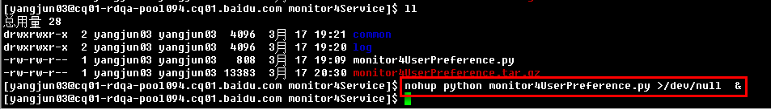
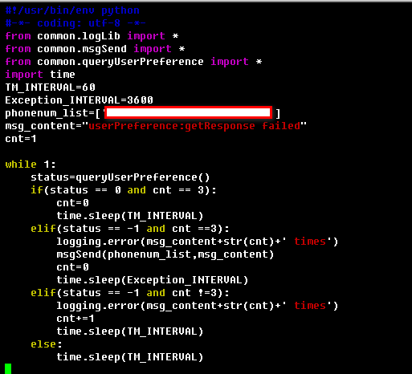

simplemonitor4pbrpcservice
==========================    

### Introduction:
simplemonitor4pbrpcservice,this monitor mainly related to use of the python module such as logging,subprocess,pbrpc and the algorithm of monitor.    

### Feature:
* service monitoring supported.
* short message supported.
* log print supported.    
    
### Dependencies:
* protobuf=>>http://code.google.com/p/protobuf/
* pbrpc

### Usage:
* script running simply like this:    

### Screenshots:    
**algorithm of the monitor:**    
    

### Kindly Reminder:
If any questions, please contact JunneYang 597092663@qq.com.
